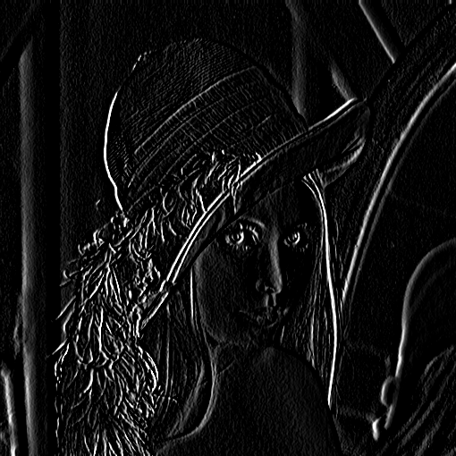
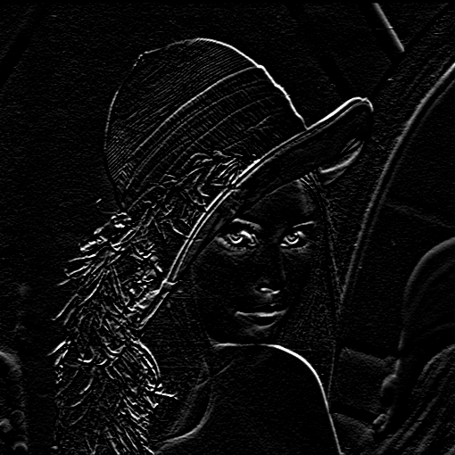
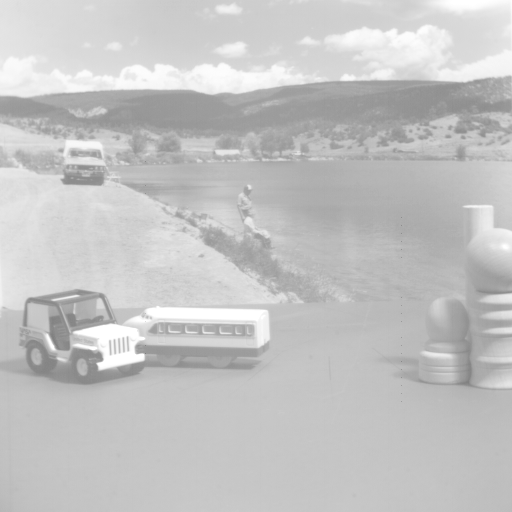
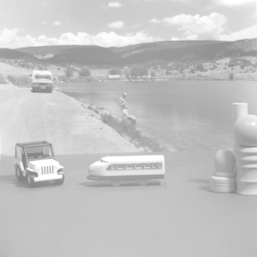
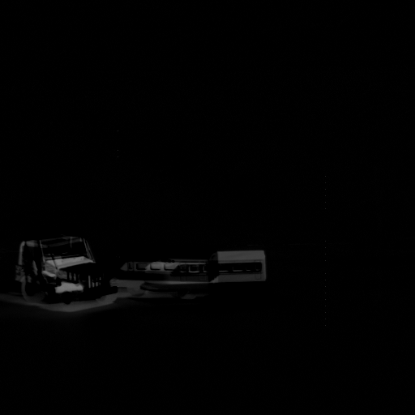

# pixelzauber
Implementing a bunch image processing algorithms for .PGM and .PPM files from scratch in C++.


## Kernels (Filters)

All images shown were produced as outputs of image processing algorithms implemented in this repository.
| Operation       | Kernel                                       | Output Image                     |
|-----------------|-----------------------------------------------|----------------------------------|
| Identity        | `[ [0 0 0], [0 1 0], [0 0 0] ]` |         |
| Box Blur         | `1/9*[ [1 1 1], [1 1 1], [1 1 1] ]` |  |
| Sharpen         | `[ [0 -1 0], [-1 5 -1], [0 -1 0] ]` |  |
| Edge Detection X-Direction | `[ [-1, 0, 1], [-2, 0, 2], [-1, 0, 1] ]` |  |
| Edge Detection Y-Direction | `[ [-1, -2, -1], [0, 0, 0], [1, 2, 1] ]` |  |

```c++
#include "./src/Mat2d.hpp"

int main() {

    // loading lena
    Mat2d<int> lena;
    lena.readPGM("lena.pgm");

    // defining a kernel for sharpening
    Mat2d<int> kernel = Mat2d<int>({
        {0, -1, 0},
        {-1, 5, -1},
        {0, -1, 0}});

    Mat2d<int> lena_sharp = applyFilter(lena, kernel).clip(0, lena.maxVal());
    lena_sharp.writePGM("lena_sharp.pgm"); 
    return 0;
}
```

## Image Difference

Let $I^{(1)}, I^{(2)} \in \mathbb{R}_{+}^{N}$ be two gray scale images. The difference of $I^{(1)}, I^{(2)}$ can be defined as:

$$
I^{(1)} - I^{(2)} \coloneqq \left| I^{(1)} - I^{(2)} \right|
$$

The difference of two images can be used to detect moving objects in a static scene.

#### Detecting Moving Objects in a static Scene

<div style="display: flex; justify-content: center; gap: 1px; text-align: center;">
  <figure>
    
    <figcaption>Image 1</figcaption>
  </figure>
  <figure>
    
    <figcaption>Image 2</figcaption>
  </figure>
  <figure>
    
    <figcaption>Difference |Image1 - Image2|</figcaption>
  </figure>
</div>

<p style="text-align: center; font-style: italic; font-size: 90%;">
  Taken from <em>University of Southern California</em>,<br>
  "motion05.512 and motion06.512",<br>
  <a href="https://sipi.usc.edu/database/database.php?volume=sequences" target="_blank">
    https://sipi.usc.edu/database/database.php?volume=sequences
  </a>
</p>


## Citations

```bibtex
@misc{lena_image,
  title        = {Lena Image},
  note         = {Accessed: 1972},
}
```