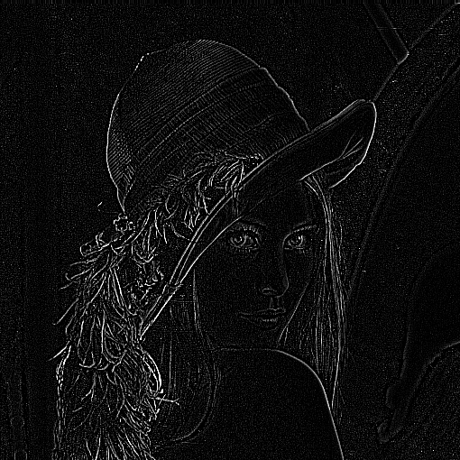

# pixelzauber
Implementing a bunch image processing algorithms for .PGM and .PPM files from scratch in C++.


## Kernel (or Filter)


All images shown were produced as outputs of image processing algorithms implemented in this repository.
| Operation       | Kernel                                       | Output Image                     |
|-----------------|-----------------------------------------------|----------------------------------|
| Identity        | $ \begin{bmatrix} 0 & 0 & 0 \\\ 0 & 1 & 0 \\\ 0 & 0 & 0 \end{bmatrix} $ |         |
| Edge Detection  | $ \begin{bmatrix} -1 & -1 & -1 \\\ -1 & 8 & -1 \\\ -1 & -1 & -1 \end{bmatrix} $ |      |
| Sharpen         | $ \begin{bmatrix} 0 & -1 & 0 \\\ -1 & 5 & -1 \\\ 0 & -1 & 0 \end{bmatrix} $ |  |


```c++
#include "./src/Mat2d.hpp"

int main() {

    // loading lena
    Mat2d<int> lena;
    lena.readPGM("lena.pgm");

    // defining a kernel for sharpening
    Mat2d<int> kernel = Mat2d<int>({
        {0, -1, 0},
        {-1, 5, -1},
        {0, -1, 0}});

    Mat2d<int> lena_sharp = applyFilter(lena, kernel);
    return 0;
}
```
