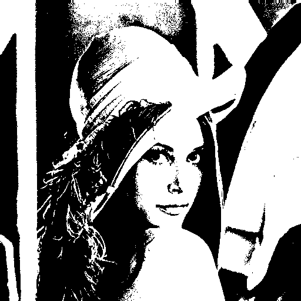

# pixelzauber
Implementing a bunch image processing algorithms for .PGM and .PPM files from scratch in C++.


## Kernels (Filters)

All images shown were produced as outputs of image processing algorithms implemented in this repository.
| Operation       | Kernel                                       | Output Image                     |
|-----------------|-----------------------------------------------|----------------------------------|
| Identity        | `[ [0 0 0], [0 1 0], [0 0 0] ]` |         |
| Box Blur         | `1/9*[ [1 1 1], [1 1 1], [1 1 1] ]` |  |
| Sharpen         | `[ [0 -1 0], [-1 5 -1], [0 -1 0] ]` |  |
| Edge Detection X-Direction | `[ [-1, 0, 1], [-2, 0, 2], [-1, 0, 1] ]` |  |
| Edge Detection Y-Direction | `[ [-1, -2, -1], [0, 0, 0], [1, 2, 1] ]` |  |

```c++
#include "./src/Mat2d.hpp"

int main() {

    // loading lena
    Mat2d<int> lena;
    lena.readPGM("lena.pgm");

    // defining a kernel for sharpening
    Mat2d<int> kernel = Mat2d<int>({
        {0, -1, 0},
        {-1, 5, -1},
        {0, -1, 0}});

    Mat2d<int> lena_sharp = applyFilter(lena, kernel).clip(0, lena.maxVal());
    lena_sharp.writePGM("lena_sharp.pgm"); 
    return 0;
}
```

## Synthetic Noise

All images shown were produced as outputs of image processing algorithms implemented in this repository.
| Noise       | Output Image                     |
|------------|----------------------------------|
| Original Image |  |
| Additive gaussian noise with mean = 0, standard deviation = 20 |  |

```c++
#include "./src/Mat2d.hpp"

int main() {
  Mat2d<int> lena;
  lena.readPGM("./pgm/lena.pgm");
  Mat2d<int> noise = Mat2d<int>::normal(0, 20, lena.rows(), lena.cols());
  noise.print(); 
  Mat2d<int> lena_noise = (lena + noise).clip(0, lena.maxVal());
  lena_noise.writePGM("lena_gaussian_noise.pgm"); 
}
```

## Image Difference

Let $I^{(1)}$, $I^{(2)}$ $\in \mathbb{R}^{N}_{+}$ be two gray scale images. The difference of $I^{(1)}$, $I^{(2)}$ can be defined as:

$$
I^{(1)} - I^{(2)} \coloneqq \left| I^{(1)} - I^{(2)} \right|
$$

The difference of two images can be used to detect moving objects in a static scene.

#### Example: Detecting Moving Objects in a static Scene
Left: Image I1, Middle: Image I2, Right: Absolute difference |I1 − I2| between Image I1 and Image I2

| Noise       | Output Image                     |
|------------|----------------------------------|
| Image I1 |  |
| Image I2 |  |
| Difference of I1 and I2|  |

<p style="text-align: left; font-style: italic; font-size: 90%;">
  Image taken from <em>University of Southern California</em>,<br>
  "motion05.512 and motion06.512",<br>
  <a href="https://sipi.usc.edu/database/database.php?volume=sequences" target="_blank">
    https://sipi.usc.edu/database/database.php?volume=sequences
  </a>
</p>

```c++
#include "./src/Mat2d.hpp"

int main() {
  Mat2d<int> frame_1;
  Mat2d<int> frame_2;
  frame_1.readPGM("./pgm/motion05.pgm");
  frame_2.readPGM("./pgm/motion06.pgm");
  Mat2d<int> diff = (frame_1 - frame_2).clip(0, frame_1.maxVal());
  diff.writePGM("motion_difference.pgm");
}
```

## Thresholding
Thresholding is the simplest way to segment an image by converting an intensity image into a binary image based on a threshold value.

| Description       |    Image                |
|------------|----------------------------------|
| Original image |  |
| The binary image resulting from a thresholding of the original image with threshold value of 125. |  |

```c++
#include "./src/Mat2d.hpp"
#include "./src/Segmentation.hpp"

int main() {
  Mat2d<int> lena;
  lena.readPGM("./pgm/lena.pgm");
  Mat2d<int> lena_threshold = thresholding(lena, 125);
  lena_threshold.writePGM("lena_threshold.pgm");
  return 0;  
}
```


## Citations

```bibtex
@misc{lena_image,
  title        = {Lena Image},
  note         = {Accessed: 1972},
}
```